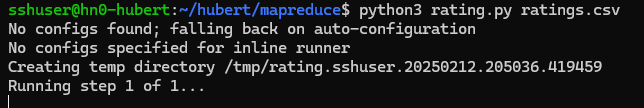
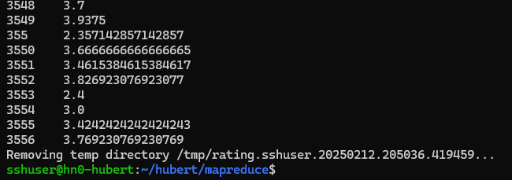
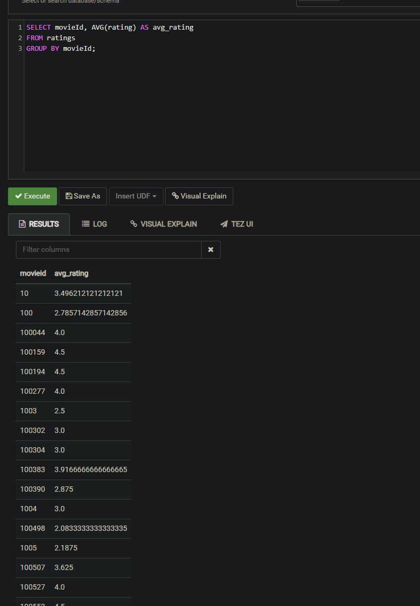
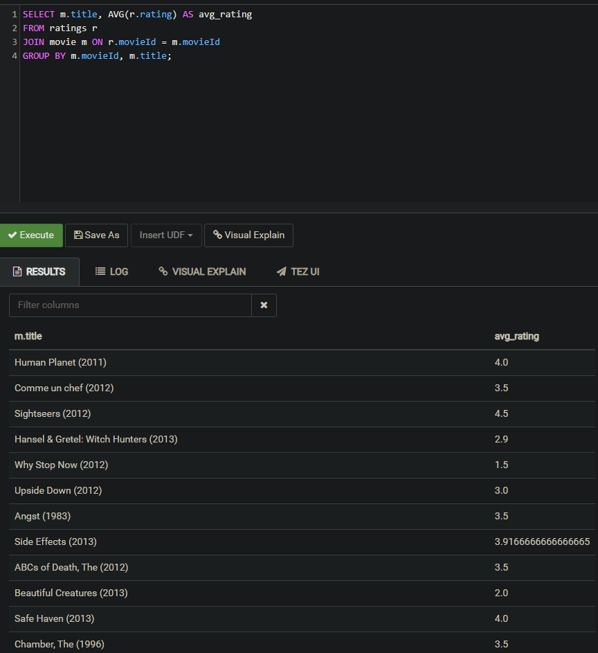
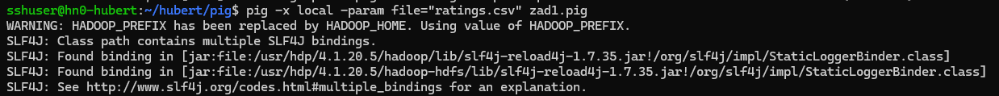
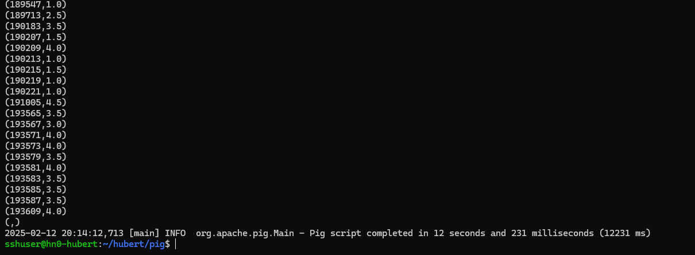
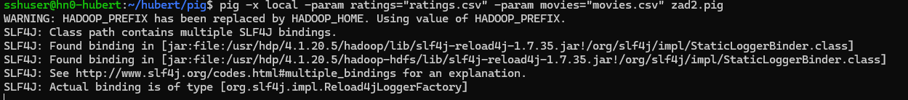
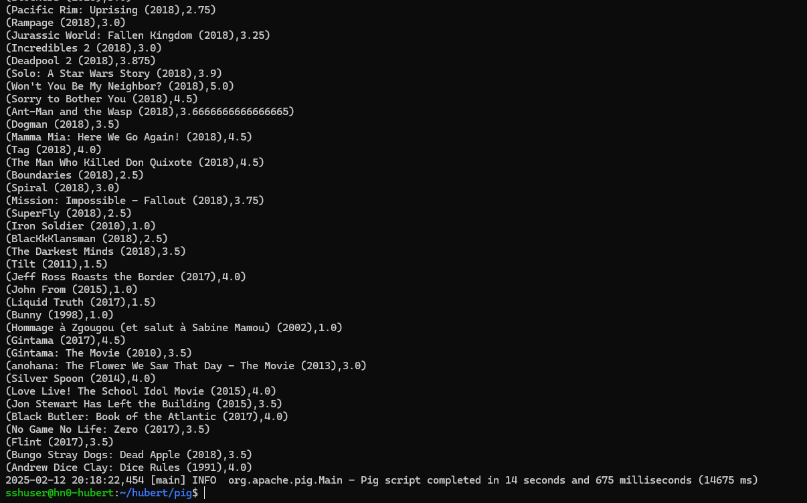

## Hubert Dzikuć (93567) BDIBD_ABU_INF_NW Zima 2024/2025  
  
Wszystkie operacje byly wykonywane na HDInsights postawionym przezemnie na Azure.

### 1 MapReduce
Wymagalo stworzenie skryptu w Python i odpalanie go przez ssh.

#### 1.1
- Skrypt:
  
```python
from mrjob.job import MRJob
from mrjob.step import MRStep

class MovieRatingsAverage(MRJob):
    def steps(self):
        return [
            MRStep(mapper=self.mapper_ratings,
                   reducer=self.reducer_average_rating),
        ]

    def mapper_ratings(self, _, line):
        # Read ratings.csv
        # Format: userId,movieId,rating,timestamp
        parts = line.split(',')
        if parts[0] != "userId":  # Skip header
            yield int(parts[1]), float(parts[2])  # (movieId, rating)

    def reducer_average_rating(self, movieId, ratings):
        ratings_list = list(ratings)
        avg_rating = sum(ratings_list) / len(ratings_list)
        yield movieId, avg_rating

if __name__ == '__main__':
    MovieRatingsAverage.run() 
```

- Screenshot:




### 2 HIVE (HQL)

#### 2.1
Wymagalo dodanie tabeli z danymi movie oraz ratings, oraz odpalenie skryptow sql.

- Skrypt:
  
```sql
SELECT movieId, AVG(rating) AS avg_rating
FROM ratings
GROUP BY movieId;
```
- Screenshot:
  


#### 2.2
- Skrypt:
  
```sql
SELECT m.title, AVG(r.rating) AS avg_rating
FROM ratings r
JOIN movie m ON r.movieId = m.movieId
GROUP BY m.movieId, m.title;
```

- Screenshot:
  


### 3 PIG

### 3.1
Wymagalo dodanie plikow oraz odpalenie skryptu pig.

- Skrypt:
  
```sql
ratings = LOAD 'data.csv' USING PigStorage(',') AS (userId:int, movieId:int, rating:float, timestamp:long);

grouped_ratings = GROUP ratings BY movieId;

average_ratings = FOREACH grouped_ratings GENERATE group AS movieId, AVG(ratings.rating) AS avg_rating;

DUMP average_ratings;
```

- Screenshot:
  



#### 3.2
Wymagalo dodanie plikow oraz odpalenie skryptu pig przez ssh.

- Skrypt:
  
```sql
ratings = LOAD 'ratings.csv' USING PigStorage(',') AS (userId:int, movieId:int, rating:float, timestamp:long);

movies = LOAD 'movies.csv' USING PigStorage(',') AS (movieId:int, title:chararray, genres:chararray);

grouped_ratings = GROUP ratings BY movieId;

average_ratings = FOREACH grouped_ratings GENERATE group AS movieId, AVG(ratings.rating) AS avg_rating;

joined_data = JOIN average_ratings BY movieId, movies BY movieId;

final_result = FOREACH joined_data GENERATE movies::movieId AS movieId, movies::title AS title, average_ratings::avg_rating AS avg_rating;

DUMP final_result;
```

- Screenshot:
  

 

### 4 NEO4J
- Skrypt:
  
```sql
CREATE (mbank:Company {name: "MBANK"})

CREATE (supervisory:Board {name: "Organ Nadzoru"}) 
CREATE (management:Board {name: "Zarzad"})
CREATE (representatives:Board {name: "Prokurenci"})

CREATE (felix:Person {name: "Felix Kremer", title: "Prokurent"})
CREATE (pawel:Person {name: "Pawel Kucharski", title: "Prokurent"})
CREATE (krzysztof:Person {name: "Krzysztof Bratos", title: "Wiceprezes Zarzadu"})
CREATE (pascal:Person {name: "Pascal Ruhland", title: "Wiceprezes Zarzadu"})
CREATE (bernhard:Person {name: "Bernhard Spalt", title: "Czlonek Organow Nadzoru"})
CREATE (thomas:Person {name: "Thomas Schaufler", title: "Czlonek Organow Nadzoru"})

CREATE (mbank)-[:HAS_SUPERVISORY_BOARD]->(supervisory)
CREATE (mbank)-[:HAS_MANAGEMENT_BOARD]->(management)
CREATE (mbank)-[:HAS_REPRESENTATIVES]->(representatives)
CREATE (supervisory)-[:OVERSEES]->(mbank)
CREATE (management)-[:MANAGES]->(mbank)
CREATE (representatives)-[:AUTHORIZED_BY]->(mbank)

CREATE (felix)-[:BELONGS_TO]->(representatives)
CREATE (pawel)-[:BELONGS_TO]->(representatives)
CREATE (krzysztof)-[:BELONGS_TO]->(management)
CREATE (pascal)-[:BELONGS_TO]->(management)
CREATE (bernhard)-[:BELONGS_TO]->(supervisory)
CREATE (thomas)-[:BELONGS_TO]->(supervisory)
```

```sql
MATCH (p:Person)-[:BELONGS_TO]->(b:Board {name: "Prokurenci"})
RETURN p.name AS Prokurent, p.title AS Title
```
