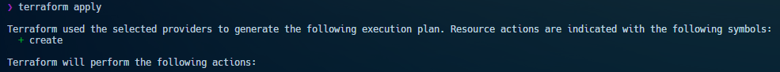
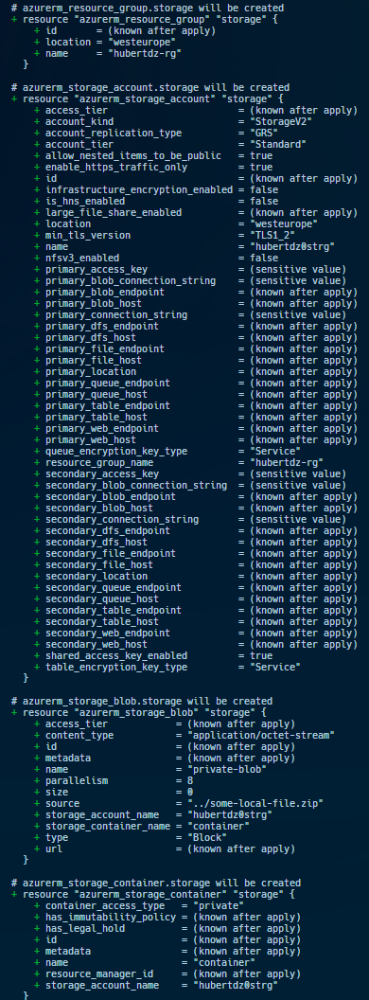
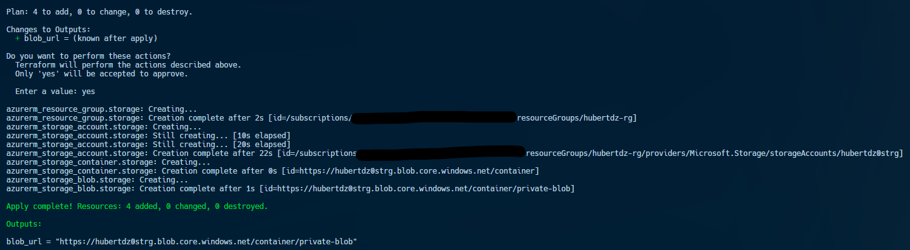
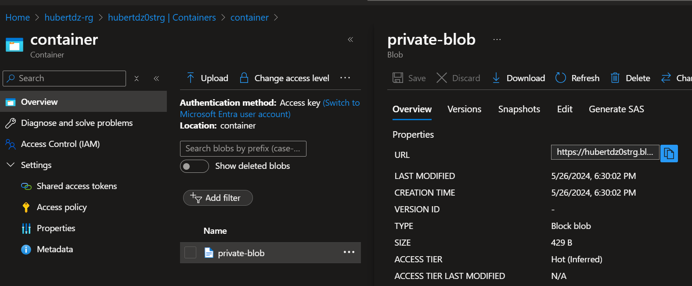

# Documentation for Azure Blob Storage provisioning using Terraform

Azure Blob Storage is Microsoft's object storage solution for the cloud.
 Blob Storage is optimized for storing massive amounts of unstructured data.
 Unstructured data is data that doesn't adhere to a particular data model or definition, such as text or binary data.

## Provisioning Steps

1. First prepare Terrraform code (which can be found inside this [Repo](https://github.com/HubiBoar/WSB/tree/main/CloudArchitecture/Zad2))
2. Create a .zip file named *some-local-file.zip*

3. Run command *terraform apply*
 

4. Check if plan is correct
 

5. Accept the plan
 

6. Check on Azure
 

