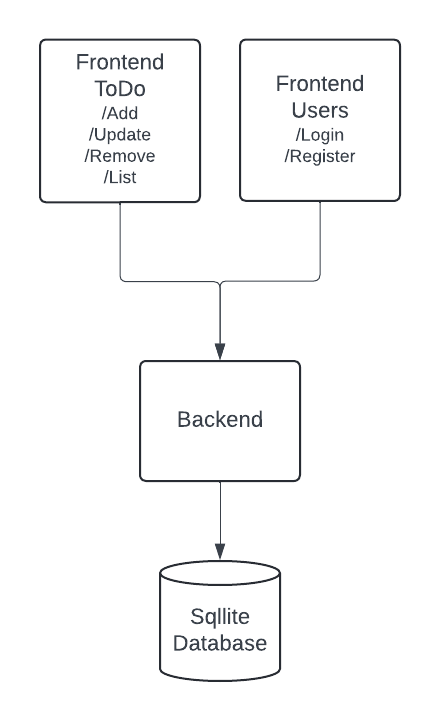

# Dokumentacja Projektu Lista ToDo

[Link do GitHub](https://github.com/HubiBoar/WsbToDo)

## Temat

Tematem projektu jest prosta aplikacja do tworzenia listy zadań do zrobionenia (ToDo) per użytkownik.

## Opis

Aplikacja po otworzeniu wymaga stworzenia konta, lub zalogowania sie. Po udanym logowaniu powinna pojawić się lista zadań ToDo, danego użytkownika.
Użytkownik powinien móc edytować liste poprzez dodawanie nowych zadań, usuwanie istniejących oraz zmiane stanu danego zadania (skończone czy nie).

## Wymagania

Użytkownicy powinni być trzymani w Bazie danych (aktualnie Sqlite) wraz ze swoimi danymi i listami zadań.
Lista zadań powinna na bieżąco aktualizować sie w bazie danych i być widoczna tylko dla aktualnie zalogowanego użytkownika.
Sesja użytkownika powinna być zapisana w formie Cookies.
Wszystkie endpointy API powinny być dostępne przy użyciu standardu OpenApi.

## Odbiorcy

Odbiorcami są ludzie potrzebujący aplikacji do tworzenia listy zadań w przeglądarce.

## Technologie

### Frontend
    - HTMX
    - CSS
    - AJAX
### Backend
    - Asp.Net
    - Sqlite
    - OpenApi
    - EntityFramework.Identity

## Testy

- Aplikacja posiada projekt do Testów jednostkowych, gdzie trzymane są testy.
- Aplikacja jest zaprojektowana tak aby w łatwy sposób można było dodać testy Integracyjne.
- HTMX ułatwia potencjalne dodanie testów End to End.

## Wyzwania

Wyzwaniem było stworzenie projektu z użyciem HTMXa, który nie jest jeszcze popularny wśród społeczności .Net,
aby to osiągnąć musiałem napisać sporo dodatkowych funkcjonalności.

## Schematy

